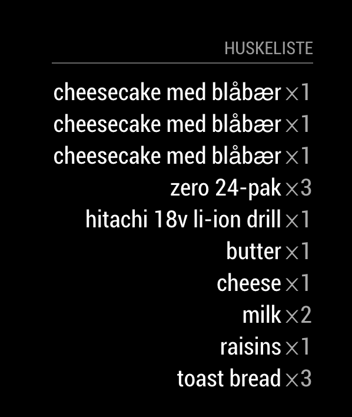

# MagicMirror² Module: StorH
'MMM-StorH' is a module for displaying your shopping list using StorH by Skog Dev [MagicMirror²](https://magicmirror.builders/). 



Current version is 1.0.0 
See [changelog](CHANGELOG.md "Version history") for version history.

## Prerequisites
- The user have downloaded StorH (iOS, Android).
- The user have created a SkogID
- The user have created a StorH group.

## Installation

Remote to your MM2-box with your terminal software and go to your MagicMirror's Module folder:
````bash
cd ~/MagicMirror/modules
````

Clone the repository:
````bash
git clone https://github.com/SkogDev/MMM-StorH.git
````

Go to the modules folder:
````bash
cd MMM-StorH
````

Install the dependencies:
````bash
npm install
````

Add the module to the modules array in the `config/config.js` file by adding the following section. You may change this configuration later:
```
{
	module: 'mmm-storh',
	header: 'StorH',
	position: 'top_left',
	config: {
		showHeader: true,
		email: 'youremailhere'
		password: 'yourpasswordhere',
		maxItems: 10
	}
}
```

# Configuration options

These are the valid configuration options you can put inside the config array above:

Configuration option | Comment | Default 
---|---|---
maxItems | Number of items to display | 5 
showHeader | Set this to true to show header above the items | false

## Group
- The module will automatically fetch the users group and items.

``` 
## Translations

This modules is translated to the following languages:

Language | Responsible
---|---
nb (Norwegian) 
en (English)


